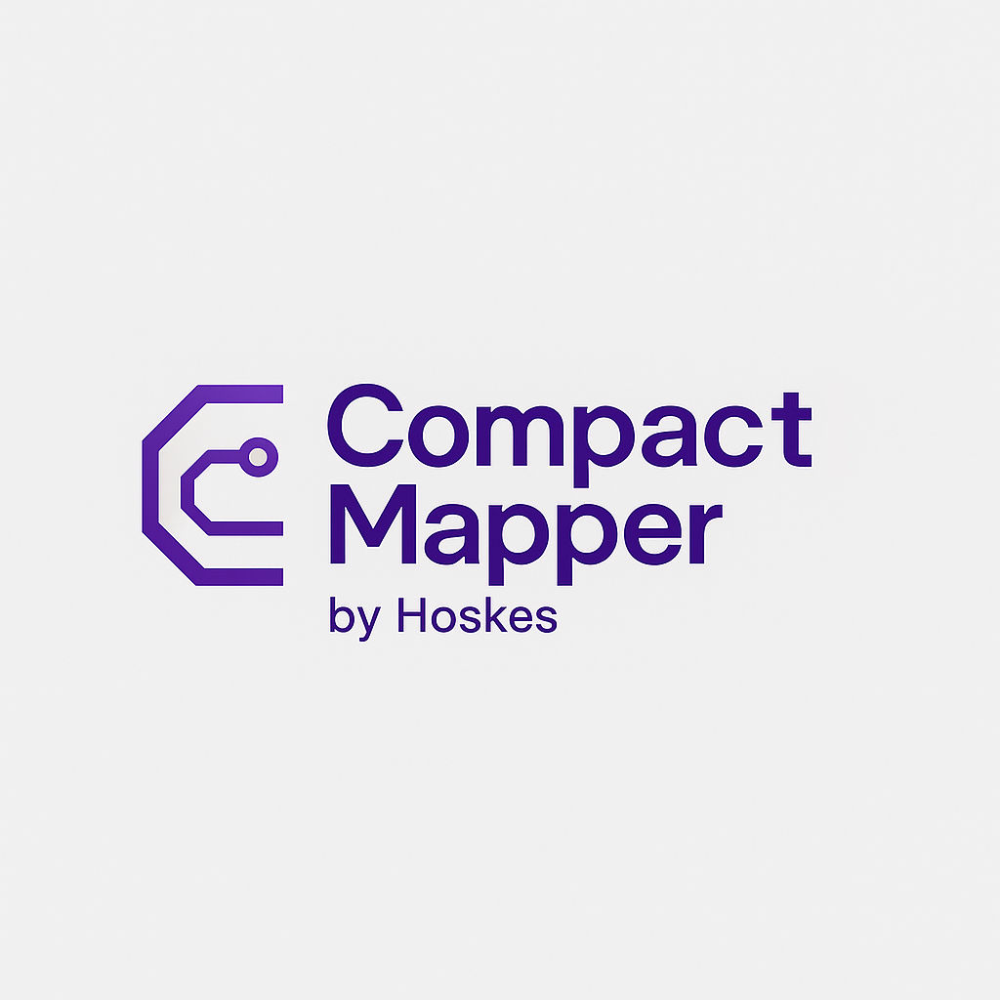

# 📦 CompactMapper

**CompactMapper** is a lightweight, fast, and fully open-source object mapper for .NET that lets you map objects between types — including complex types and collections — with just one line of code.

> 🟢 **No dependencies. No profiles. No configuration. Just pure mapping.**  
> 🔄 **An open-source alternative to AutoMapper, which is now commercially licensed.**

---

## 🚀 Why CompactMapper?

AutoMapper is an industry-standard library for object mapping in .NET — but starting from version 12, **AutoMapper is no longer free for commercial use** under its new license.

**CompactMapper** is:
- ✅ Free and open-source
- ✅ Simple and extensible
- ✅ Handles nested mapping and collections
- ✅ Ideal for DTO mapping, clean architecture, and layering concerns

---

## ✨ Features

- 🔄 Automatic mapping of properties by name (case-insensitive)
- 🧠 Recursive mapping of nested objects
- 📚 Collection and array mapping
- 🎯 Optional custom mappings using lambdas
- 🧰 Optional value transformers (e.g., trimming, formatting, sanitizing)
- 💡 No reflection after initial setup — highly efficient

---

## 📦 Installation

Just copy the `CompactMapperExtension` class into your project. No NuGet package required (yet).  
A package may be available in the future for easier installation.

---

## 🧑‍💻 Usage

### 🔹 1. Basic Mapping

```csharp
var customerDto = customer.MapTo<CustomerDto>();
```

### 🔹 2. Mapping with Nested Objects

```csharp
var dto = order.MapTo<OrderDto>(); // Will also map order.Customer, order.Items, etc.
```

### 🔹 3. Mapping Collections

```csharp
List<CustomerDto> customerDtos = customers.MapTo<List<CustomerDto>>();
```

Works for `List<T>`, `IEnumerable<T>`, `T[]`, etc.

### 🔹 4. Custom Mapping Logic

```csharp
CompactMapperExtension.AddCustomMapping<Customer, CustomerDto>((src, dest) =>
{
    dest.FullName = $"{src.FirstName} {src.LastName}";
});
```

### 🔹 5. Value Transformation (Optional)

```csharp
var dto = user.MapTo<UserDto>(valueTransformer: (prop, value) =>
{
    if (prop == "Email" && value is string email)
        return email.ToLowerInvariant();

    return value;
});
```

---

## 📐 Example

### 🧱 Entities

```csharp
public class Customer
{
    public int Id { get; set; }
    public string Name { get; set; }
    public Address Address { get; set; }
    public List<Order> Orders { get; set; }
}

public class Address
{
    public string Street { get; set; }
}
```

### 📦 DTOs

```csharp
public class CustomerDto
{
    public int Id { get; set; }
    public string Name { get; set; }
    public AddressDto Address { get; set; }
    public List<OrderDto> Orders { get; set; }
}

public class AddressDto
{
    public string Street { get; set; }
}
```

### ✅ Mapping

```csharp
var customerDto = customer.MapTo<CustomerDto>();
```

No config, no fuss — deeply nested and collections mapped out of the box!

---

## 💬 Why Not AutoMapper?

| Feature                  | AutoMapper        | CompactMapper        |
|--------------------------|-------------------|-----------------------|
| Free for commercial use | ❌ (v12+)         | ✅ Always             |
| Configuration required   | ✅ Yes            | ❌ No                 |
| Profiles and Setup       | ✅ Required       | ❌ Not Needed         |
| Collection Support       | ✅ Yes            | ✅ Yes                |
| Nested Object Mapping    | ✅ Yes            | ✅ Yes                |
| Custom Actions           | ✅ Yes            | ✅ Yes                |
| Lightweight              | ❌ Heavy at times | ✅ One class only     |

---

## 🛠️ Under the Hood

- Uses reflection only at runtime, no compilation step
- Recursive mapping using `MethodInfo.MakeGenericMethod`
- Collection type detection via `IEnumerable<>` interfaces
- Internal registry of custom mappings per type pair

---

## 📣 Roadmap

- [ ] NuGet Package: `CompactMapper`
- [ ] Fluent API style (optional config)
- [ ] Support for flattening/nested property paths
- [ ] Dictionary mapping (`Dictionary<string, object>` ↔ POCO)

---

## 📝 License

**MIT License** – free to use for personal and commercial projects.

---

## 🙌 Contributing

Want to help improve CompactMapper? PRs are welcome!  
If you'd like to add features or extensions (like flattening or reverse mapping), feel free to fork and contribute.

---

## 📫 Contact

Feel free to open an issue or reach out if you use CompactMapper in your project — we'd love to hear how it's helping!